```{r setup, include=FALSE}
knitr::opts_chunk$set(echo = FALSE)
```

## <span style="color:#88398A">Proyecto Final</span>

- Curso: Nuevas tecnologías para el análisis estadístico de datos

- Docente: Dra. Natalia da Silva

- Ayudante: Mag. Federico Molina

## <span style="color:#88398A">Datos</span>

Se analizarán datos de una encuesta agropecuaria, que fueron elegidos para llevar a cabo el objetivo general de lograr una actualización del consumo intermedio del rubro ganadero en el marco de la actualización.

Ésta encuesta fue realizada por el Ministerio de Ganadería, Agricultura y Pesca del Uruguay, con participacion de otras orgaizaciones.

Trata de un muestreo cuya base muestral fue el censo general agropecuario del 2011, las preguntas eran multiple opción (en su mayoría) con una recodificación numérica con un total de 821. El tamaño de la muestra resultó ser de  1.426 casos (explotacion con actividad principal a la ganaderia vacuna u ovina).En este trabajo se propone una descripción de los resultados de la encuesta sin expandir a través de ponderadores.


## <span style="color:#88398A">Variables a utilizar</span>

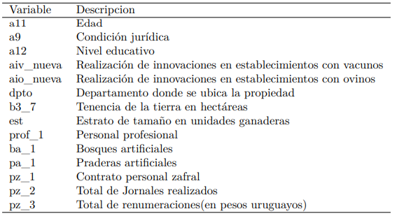{width=70%}

## <span style="color:#88398A">Edad y sexo</span>

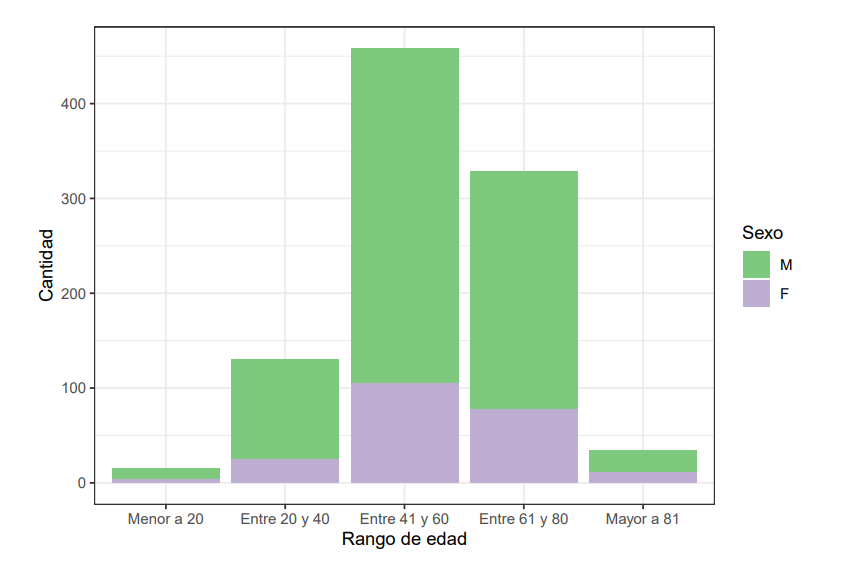{width=70%}

## <span style="color:#88398A">Innovación</span>

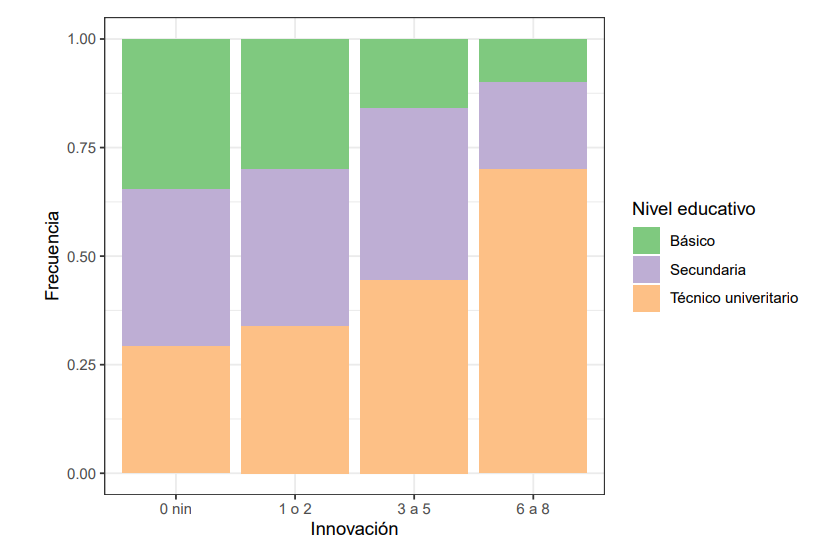{width=49%}

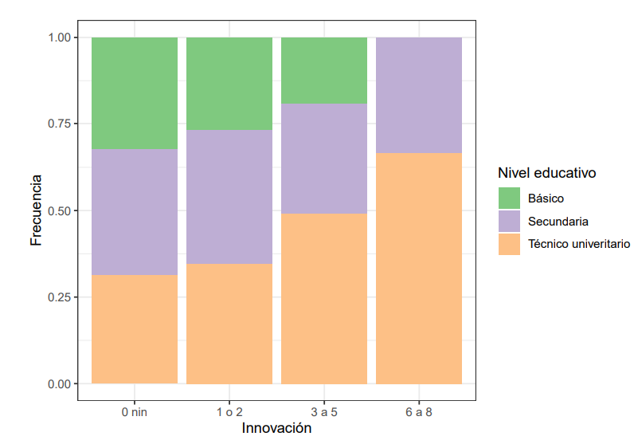{width=49%}

## <span style="color:#88398A">Innovación</span>

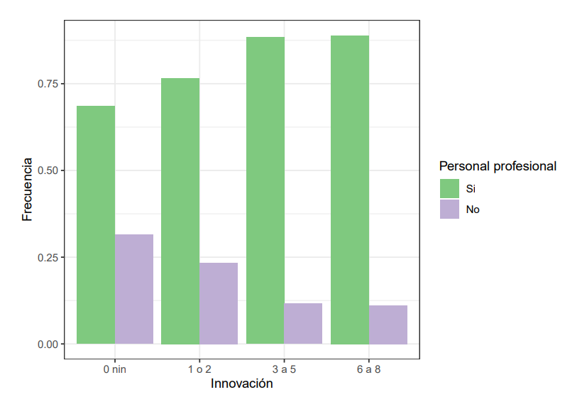{width=49%}

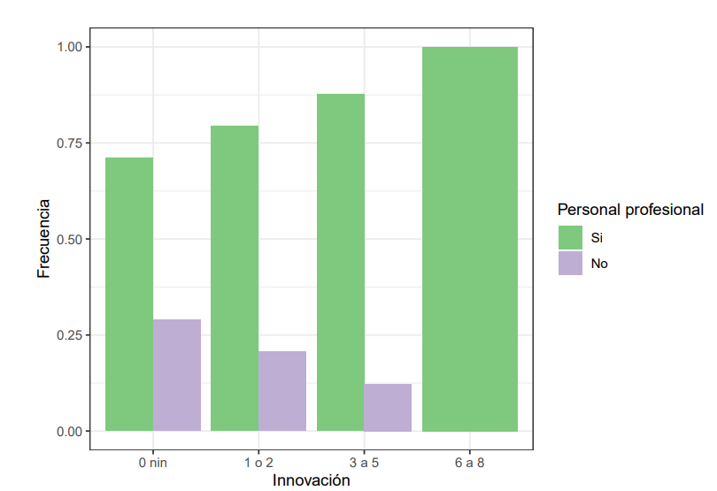{width=49%}

## <span style="color:#88398A">Innovación</span>

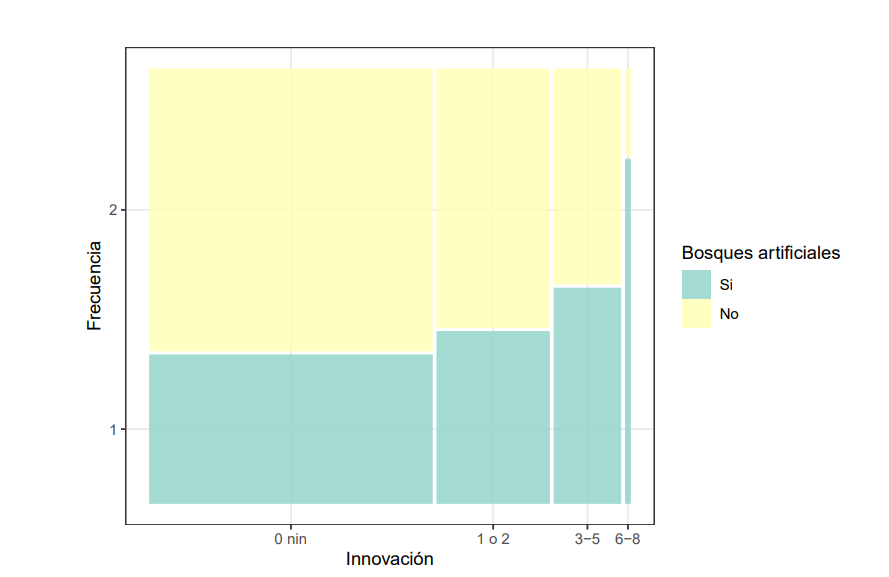{width=49%}

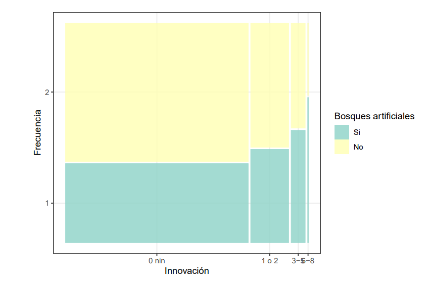{width=49%}

## <span style="color:#88398A">Innovación</span>

{width=49%}

{width=49%}

## <span style="color:#88398A">Innovación</span>

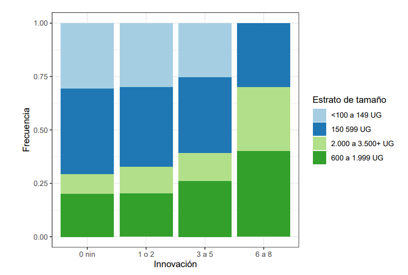{width=49%}

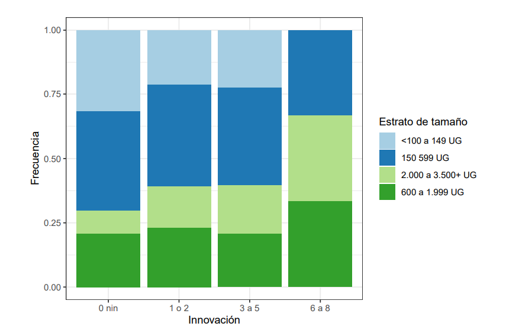{width=49%}

## <span style="color:#88398A">Estrato de tamaño</span>

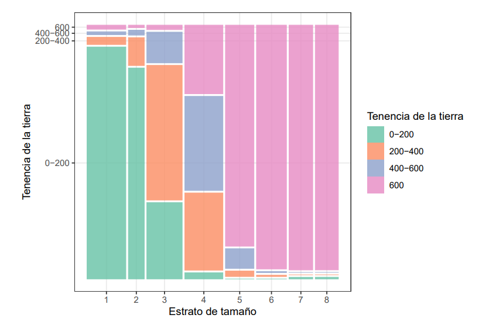{width=70%}

## <span style="color:#88398A">Personal zafral y profesional</span>

{width=41%}
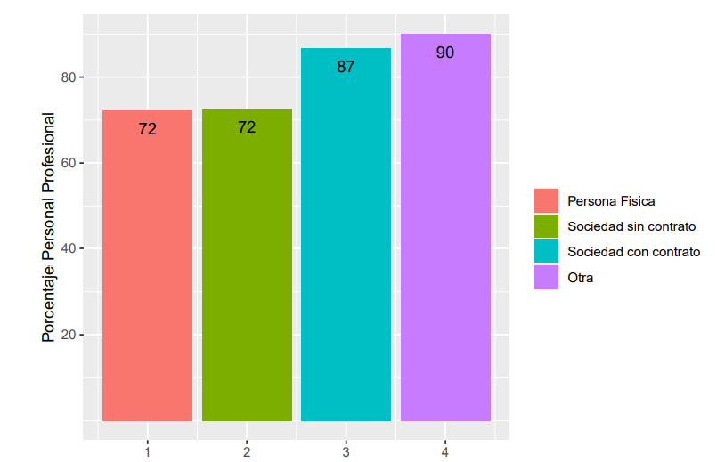{width=51%}

## <span style="color:#88398A">Remuneración</span>

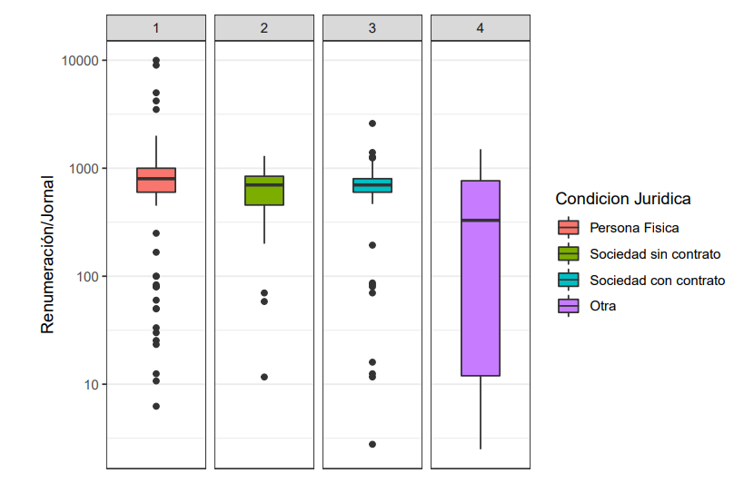{width=70%}

## <span style="color:#88398A">Sueldo</span>

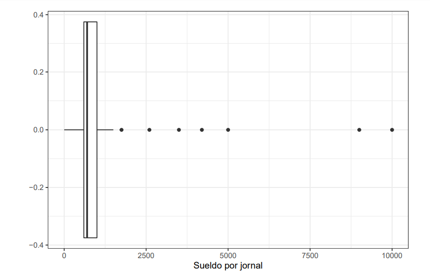{width=70%}

## <span style="color:#88398A">Gráfico interactivo</span>

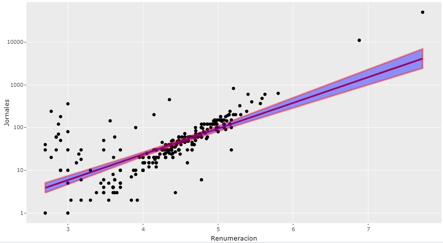{width=70%}

